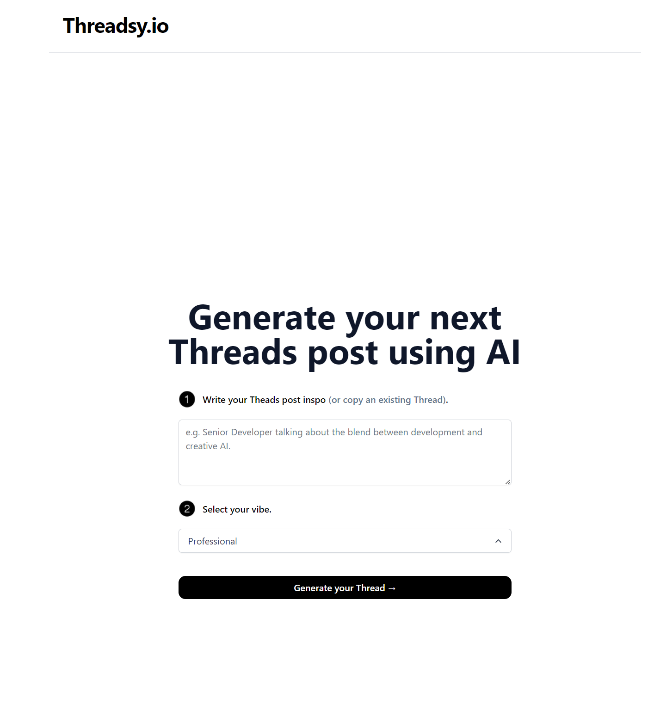

<<<<<<< HEAD
# [digitalthreadsy.com](https://www.digitalthreadsy.com/)

This project generates Threads posts for you using AI.

[](https://www.digitalthreadsy.com)

## How it works

This project uses the [ChatGPT API](https://openai.com/api/) and [Vercel Edge functions](https://vercel.com/features/edge-functions) with streaming. It constructs a prompt based on the form and user input, sends it to the chatGPT API via a Vercel Edge function, then streams the response back to the application.

## Running Locally

After cloning the repo, go to [OpenAI](https://beta.openai.com/account/api-keys) to make an account and put your API key in a file called `.env`.

Then, run the application in the command line and it will be available at `http://localhost:3000`.

```bash
npm run dev
```

=======
# [handleone.social](https://handle-one.vercel.app/)

Checks social media handles if they are available

## How it works

This Project uses Vercel

## Running Locally

Then, run the application in the command line and it will be available at `http://localhost:3000`.

>>>>>>> c64cc8c073a1462ed451f0069dbd283c42692587
## One-Click Deploy

Deploy the example using [Vercel](https://vercel.com?utm_source=github&utm_medium=readme&utm_campaign=vercel-examples):

<<<<<<< HEAD
[](https://vercel.com/new/clone?repository-url=https://github.com/espinozahector/threads-post&env=OPENAI_API_KEY&project-name=threads-post-generator&repo-name=threads-post)
=======
[](https://vercel.com/new/clone?repository-url=https://github.com/Nutlope/twitterbio&env=OPENAI_API_KEY&project-name=twitter-bio-generator&repo-name=twitterbio)
>>>>>>> c64cc8c073a1462ed451f0069dbd283c42692587
